<div align="center">


<h1>PlanIt – Your All-in-One Travel Companion</h1>

<p>
Cross-platform travel planning & hotel booking app made with ❤️ by students of NIT Silchar.
</p>

<a href="#-features">Features</a> •
<a href="#️-tech-stack">Tech Stack</a> •
<a href="#️-screenshots">Screenshots</a> •
<a href="#-setup-instructions">Installation</a> •
<a href="#-collaborators">Collaborators</a>


[](https://flutter.dev)
[](https://nodejs.org)
[](https://expressjs.com)
[](https://mongodb.com)
[](https://www.docker.com/)
[](https://fly.io)
[](https://android.com)
[](LICENSE)

---


</div >

## 🌐 Overview

PlanIt is a cross-platform, full-stack travel assistant app built with Flutter and Node.js. It helps users effortlessly plan trips, book hotels, manage itineraries, and stay safe with built-in emergency modules. From discovering attractions to sending SOS signals — PlanIt is your ultimate travel buddy.

---

## 📱 Download

<a href="https://limewire.com/d/UElzq#5q0PLAEtNJ" target="_blank">
  
</a>

> ⚠️ To install the APK, temporarily disable Google Play Protect. Some emergency features may trigger security warnings due to telephony and location access.

---

## 🚀 Features

- 🗂️ Create, manage, and view multiple trips
- 🏨 Real-time hotel search via TripAdvisor
- 📍 Location-aware attraction discovery
- 🗺️ Google Maps and autocomplete integration
- 🛡️ SOS Module: Send SMS, make emergency calls
- 🔒 JWT-authenticated secure login/signup
- 📱 Offline support and Firebase cloud sync (future scope)
---

## 🌐 API Mentions

- [Google Places API](https://developers.google.com/maps/documentation/places/web-service/overview): Place search, autocomplete, and details
- [Google Maps API](https://developers.google.com/maps/documentation/maps-static/overview): Map display and geolocation
- [Tripadvisor RapidAPI](https://rapidapi.com/apidojo/api/tripadvisor-com): Hotel search and booking data
- 📲 Device Telephony/SMS: For sending emergency alerts and direct calling via SOS feature
- 📧 Gmail SMTP (OAuth2): Used to send password reset and notification emails securely

---

## ⚙️ Tech Stack

| Layer      | Technologies Used                                                                 |
|------------|------------------------------------------------------------------------------------|
| Frontend   | Flutter, Dart, Google Maps, Material UI, Provider                                 |
| Backend    | Node.js, Express, MongoDB, JWT Auth, Joi, Nodemailer, Winston, Docker             |
| APIs       | TripAdvisor (RapidAPI), Google Maps + Places API, Telephony/SMS, Gmail OAuth2     |
| DevOps     | Dockerized backend, Deployed on Fly.io                                             |

---

> 📸 **See screenshots below for a visual tour of each feature!**


## 🖼️ Screenshots

### 🧭 Trip Planning Flow
<table><tr>
<td>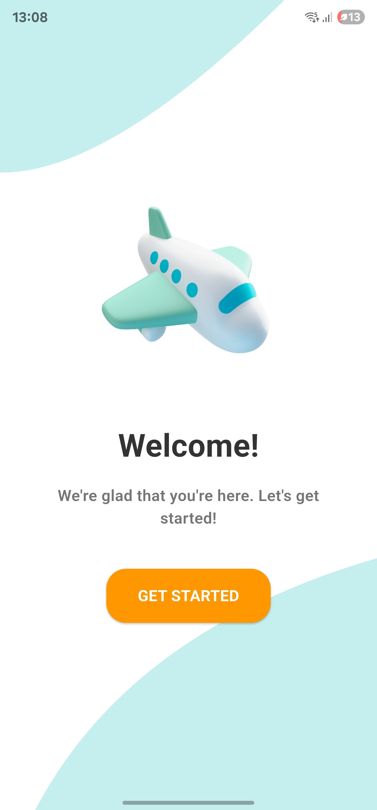</td>
<td>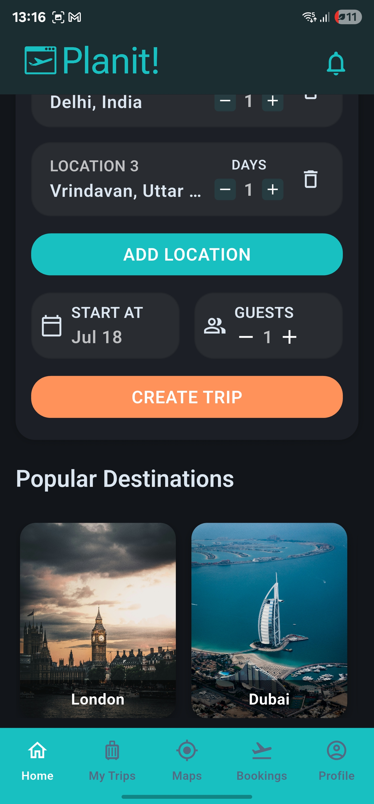</td>
<td>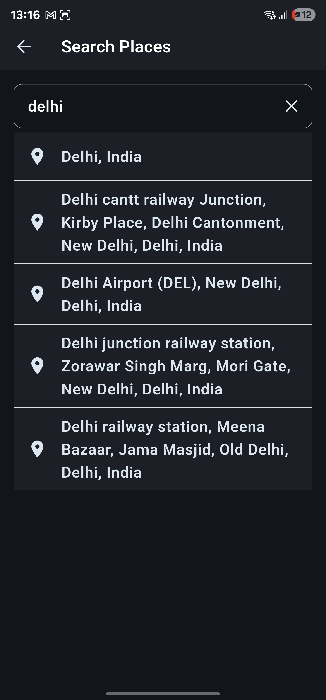</td>
<td>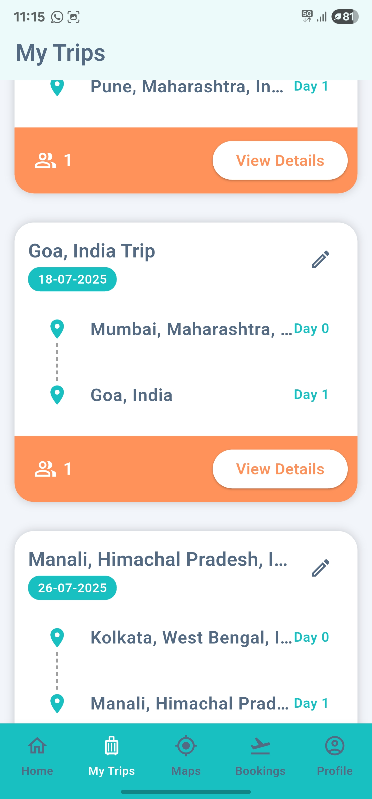</td>
</tr></table>

### 🏨 Hotel & Attraction Discovery
<table><tr>
<td>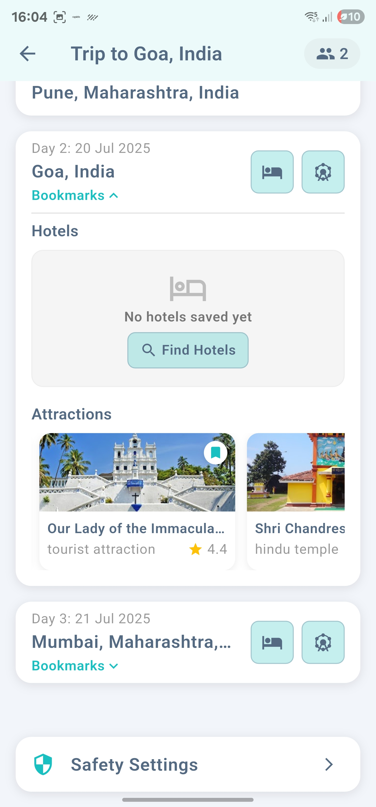</td>
<td>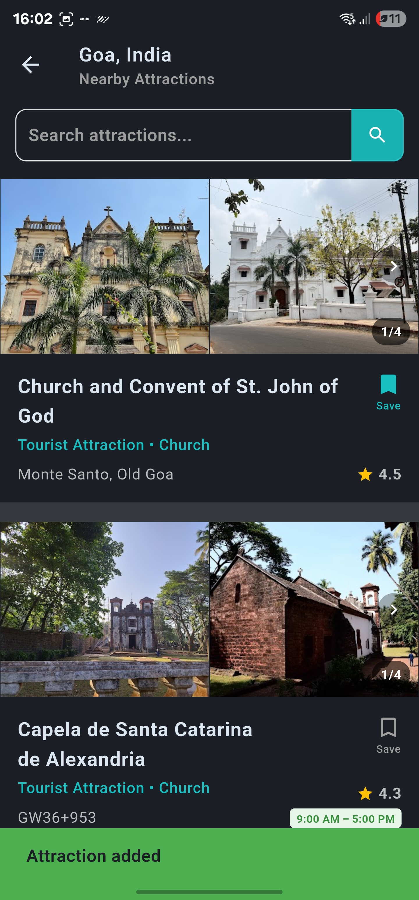</td>
<td>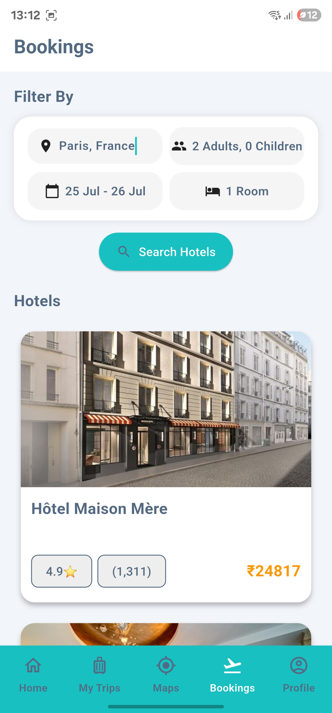</td>
</tr></table>

### 🗺️ Interactive Maps
<table><tr>
<td>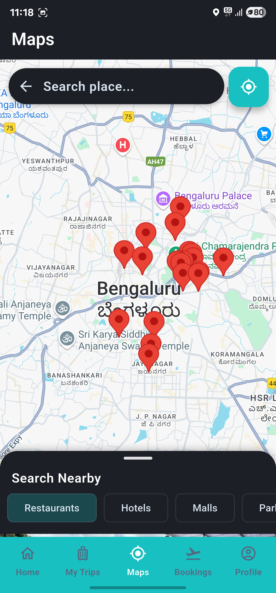</td>
<td>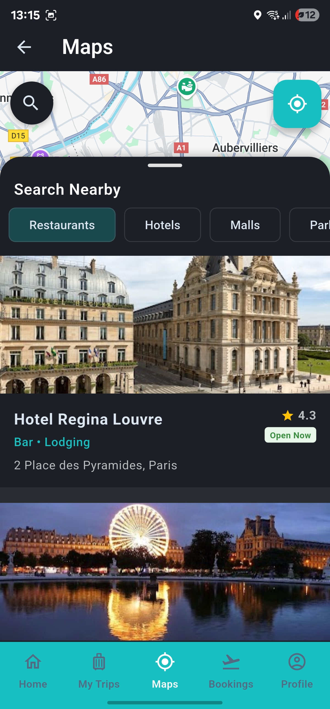</td>
</tr></table>

### 🛡️ Profile & Safety
<table><tr>
<td>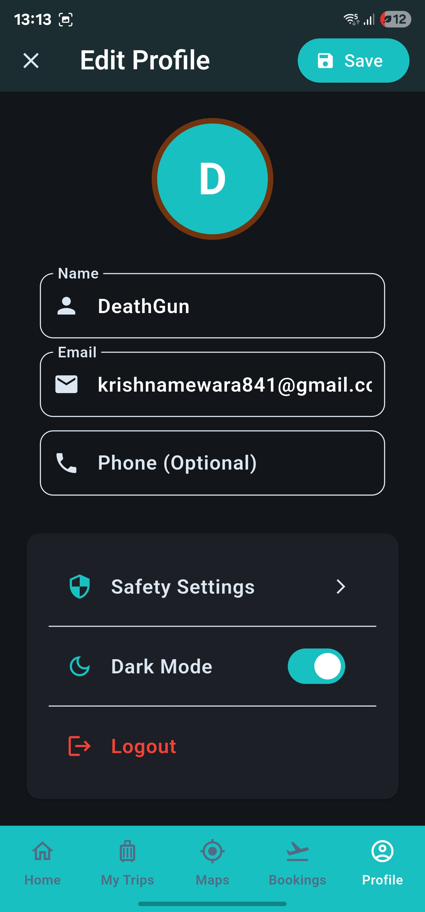</td>
<td>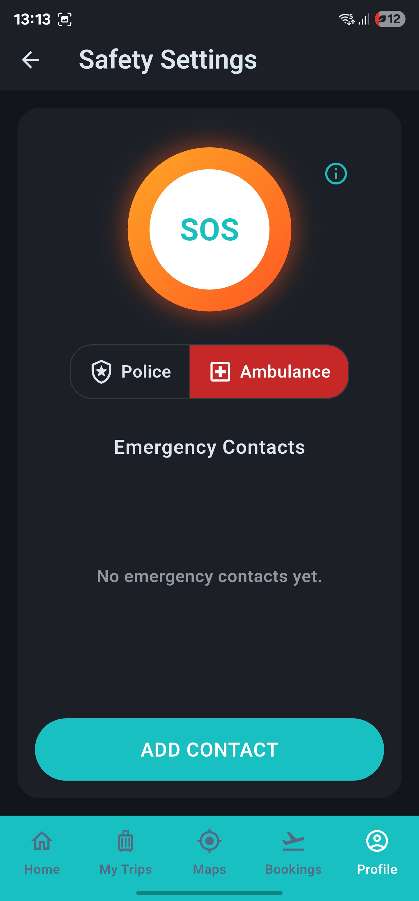</td>
</tr></table>

> 📂 Want to view them all at once? Download the full screenshots PDF from this repo!

---

## 🚧 Future Plans

- 🤝 Group Collaborations: Plan trips with friends, co-edit itineraries, and manage shared bookings.
- ✈️ Travel Suggestions: AI-powered transport recommendations (flights, trains, buses).
- 🔔 Notification System: Alerts for upcoming bookings, trip changes, or emergencies.
- 🌍 Multi-Language Support: Regional language interface options.

---

## 🧰 Setup Instructions

### 🔧 Clone & Run Frontend

```bash
git clone https://github.com/Ecell23/Travel-App-Frontend.git
cd Travel-App-Frontend
flutter pub get
flutter run

```

## 🛠️ Backend Setup

For backend setup, refer to the backend repository:

🔗 [Backend Repository](https://github.com/Ecell23/Travel-App) 

---

## 👥 Collaborators

Made with 💙 by:

- [Krishna Mewara](https://github.com/DeathGun44)
- [Premansh Chakraborty](https://github.com/PremanshChakraborty) 
- [Mannate Jain](https://github.com/Mannate14)

---

## 📝 License

This project is licensed for educational and demo purposes. For commercial use, please contact the developers.

<div align="center">

Built with 🚀 by passionate student developers @ NIT Silchar

</div>

